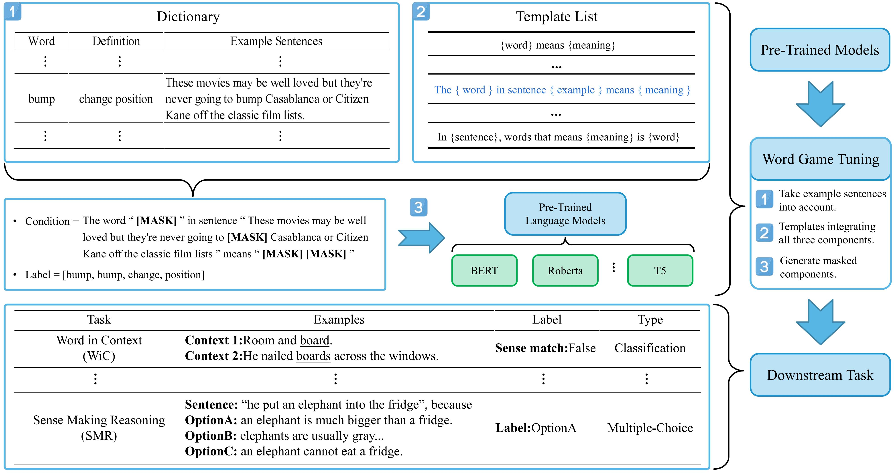

# DictPrompt
Implementation of paper: [DictPrompt: How Dictionary Helps Pre-training When Integrating Prompt-learning]()

## TL;DR
We propose a generalized dictionary-based additional pre-training method using the prompt learning method.

## Abstract
The textual semantics contained in the PLM (Pre-trained Language Model) is constrained by the text distribution in the original training corpus. Due to the lack of sufficient contextual training corpus, the low-frequency word representations in the PLM often have difficulty capturing their actual semantics. Previous research has shown that using semantic information from dictionaries can alleviate this problem. Unfortunately, these works neglected the infinite potential of example sentences from different target words with various meanings. To re-explore methods for enhancing PLM using the dictionary, we propose a novel **Dict**ionary-based tuning approach integrating the latest **Prompt** learning (**DictPrompt**). We first collect a dataset based on *the Oxford Advanced Learner’s English Dictionary*. Then, we designed a set of prompt templates with the corpus combining the word, the definition, and its example sentence. Finally, we insert a word game training task between pre-training and fine-tuning using these templates, allowing the model to inject more semantic information into PLM. The experiments on three commonly used models show that our Dict-prompt method can bring additional gains to the model performance. Especially can improve pre-trained model performance on five fine-grained semantic tasks, such as 1.2% accuracy gains on the WiC task.

## Pipeline
An illustration of DictPrompt pipeline.

## Results in our paper:
Besides comparing the model after DictPrompt tuning with the vanilla models, we also compare with the following related PLM optimizing works: (1) SemPre<a href="#ref1">1</a>, (2) ElitePLM<a href="#ref2">2</a>, (3) GenDef<a href="#ref3">3</a>, (4) Knowledge-BERT<a href="#ref4">4</a>, (5) P-tuning<a href="#ref5">5</a>, (6) P-tuning V2<a href="#ref6">6</a>.

|               | Model                 | WiC              | WSC              | SM               | SMR              | HS               |
|---------------|-----------------------|------------------|------------------|------------------|------------------|------------------|
| BERT-base     | vanilla (our) (avg.)  | 69.75            | 63.46            | 87.21            | 83.72            | 39.17            |
|               | GenDef                | 68.64            | ---              | ---              | ---              | ---              |
|               | ElitePLM              | 69.90            | 60.60            | 87.30            | 80.10            | **40.50**        |
|               | SemPre (our) (avg.)   | 69.91            | 65.39            | 87.31            | 81.82            | 39.19            |
|               | our+all words (best)  | **71.79**        | **68.27**        | **89.40**        | **85.20**        | <ins>39.44</ins> |
|               | our+all words (avg.)  | <ins>70.53</ins> | <ins>66.35</ins> | <ins>87.92</ins> | <ins>84.38</ins> | 39.26            |
|               | our+rare words (avg.) | 70.46            | <ins>66.35</ins> | 87.53            | 83.12            | 38.27            |
| BERT-large    | SuperGLUE reported    | 69.50            | 64.30            | ---              | ---              | ---              |
|               | vanilla (our) (avg.)  | 71.00            | 68.27            | 89.67            | 86.88            | 43.81            |
|               | ElitePLM              | 72.70            | 63.50            | 89.40            | 85.80            | **47.30**        |
|               | SemPre (our)(avg.)    | 69.04            | 70.67            | 87.17            | 85.90            | 43.73            |
|               | Knowledge-BERT        | 70.90            | ---              | ---              | ---              | ---              |
|               | P-tuning              | 63.00            | 64.40            | ---              | ---              | ---              |
|               | P-tuning V2           | **75.10**        | 68.30            | ---              | ---              | ---              |
|               | our+all words (best)  | **73.98**        | **76.92**        | **90.80**        | **88.80**        | <ins>45.23</ins> |
|               | our+all words (avg.)  | 72.10            | <ins>71.15</ins> | <ins>90.55</ins> | <ins>88.23</ins> | 44.19            |
|               | our+rare words (avg.) | 71.79            | <ins>71.15</ins> | 88.97            | <ins>88.23</ins> | 44.19            |
| Roberta-base  | vanilla (from SemPre) | 69.40            | 62.50            | 75.00            | 40.00            | 41.30            |
|               | vanilla (our) (avg.)  | 70.93            | 66.35            | 87.70            | 88.70            | 62.10            |
|               | ElitePLM              | 67.20            | <ins>71.10</ins> | **89.30**        | 87.50            | 61.00            |
|               | SemPre                | <ins>71.50</ins> | 63.60            | 77.70            | 39.50            | 41.70            |
|               | SemPre (our) (avg.)   | 69.51            | 64.42            | 87.80            | 88.73            | <ins>62.41</ins> |
|               | our+all words (best)  | **72.88**        | **73.08**        | **88.90**        | **89.50**        | **62.68**        |
|               | our+all words (avg.)  | 71.47            | 67.31            | 87.80            | <ins>88.98</ins> | 62.29            |
|               | our+rare words (avg.) | 70.38            | 66.35            | 87.80            | 88.40            | 62.10            |
| Roberta-large | vanilla (from SemPre) | 74.60            | 69.30            | 79.20            | 47.30            | 48.90            |
|               | vanilla (our) (avg.)  | 71.55            | 70.67            | 93.72            | 92.23            | 81.26            |
|               | ElitePLM              | 72.70            | 75.00            | 93.00            | 92.30            | **85.20**        |
|               | SemPre                | <ins>75.70</ins> | 73.50            | 80.40            | 48.40            | 75.90            |
|               | SemPre (our) (avg.)   | 71.55            | 73.08            | 93.66            | 92.35            | 81.27            |
|               | P-tuning              | 56.90            | 64.40            | ---              | ---              | ---              |
|               | P-tuning V2           | 73.40            | 63.50            | ---              | ---              | ---              |
|               | our+all words (best)  | **75.86**        | **81.73**        | **95.30**        | **93.70**        | 81.96            |
|               | our+all words (avg.)  | 74.61            | <ins>76.92</ins> | <ins>94.05</ins> | <ins>93.08</ins> | 81.35            |
|               | our+rare words (avg.) | 73.28            | <ins>76.92</ins> | 93.85            | 92.39            | 81.27            |
| T5-base       | vanilla (our)         | 68.73            | 62.50            | 86.74            | 86.60            | 55.87            |
|               | ElitePLM              | 68.30            | **79.80**        | **89.20**        | 82.90            | 55.20            |
|               | SemPre (our)          | 68.42            | 62.02            | 86.58            | 85.36            | 56.53            |
|               | our+all words(best)   | **72.41**        | <ins>71.15</ins> | <ins>88.30</ins> | **87.90**        | **57.84**        |
|               | our+all words(avg.)   | <ins>70.14</ins> | 64.90            | 87.53            | <ins>86.90</ins> | <ins>57.63</ins> |
|               | our+rare words        | 70.06            | 63.94            | 87.04            | <ins>86.90</ins> | 57.63            |
| T5-large      | vanilla (our)         | 71.32            | <ins>69.23</ins> | 92.48            | 91.23            | 82.85            |
|               | ElitePLM              | 69.30            | **84.60**        | 92.70            | 88.20            | 79.10            |
|               | SemPre (our)          | 71.32            | 68.27            | 92.69            | 90.48            | 82.92            |
|               | our+all words(best)   | **74.92**        | <ins>76.92</ins> | **93.60**        | **92.10**        | **83.21**        |
|               | our+all words(avg.)   | <ins>72.57</ins> | 72.12            | <ins>92.73</ins> | <ins>91.39</ins> | <ins>82.99</ins> |
|               | our+rare words        | 72.10            | 72.12            | <ins>92.73</ins> | 91.32            | 82.96            |

Comparable results of proposed DictPrompt with baselines on five downstream tasks. The **bold** represents the best result, and the <ins>underlined</ins> represents the second best result.

## Requirement
You may need the following environment dependencies:
- python: 3.9.0
- pytorcch:1.8.2
- transformers:4.20.0
- datasets:1.18.4
- scikit-learn:1.0.1
- numpy:1.21.4
- jsonlines:3.0.0

> ## References
> 
1. Ren X, Sun X, Wang H, et al. Towards semantics-enhanced pre-training: Can lexicon definitions help learning sentence meanings?[C]//Proceedings of the AAAI Conference on Artificial Intelligence. 2021, 35(15): 13736-13744.

> 
2. Li J, Tang T, Gong Z, et al. ElitePLM: An Empirical Study on General Language Ability Evaluation of Pretrained Language Models[J]. arXiv preprint arXiv:2205.01523, 2022.

> 
3. Chang T Y, Chen Y N. What does this word mean? explaining contextualized embeddings with natural language definition[C]//Proceedings of the 2019 Conference on Empirical Methods in Natural Language Processing and the 9th International Joint Conference on Natural Language Processing (EMNLP-IJCNLP). 2019: 6064-6070.

> 
4. Peters M E, Neumann M, Logan R, et al. Knowledge Enhanced Contextual Word Representations[C]//Conference on Empirical Methods in Natural Language Processing and the 9th International Joint Conference on Natural Language Processing (EMNLP-IJCNLP). 2019.

> 
5. Liu X, Zheng Y, Du Z, et al. GPT understands, too[J]. arXiv preprint arXiv:2103.10385, 2021.

> 
6. Xiao Liu, Kaixuan Ji, Yicheng Fu, Weng Tam, Zhengxiao Du, Zhilin Yang, and Jie Tang. 2022. P-Tuning: Prompt Tuning Can Be Comparable to Fine-tuning Across Scales and Tasks. In Proceedings of the 60th Annual Meeting of the Association for Computational Linguistics (Volume 2: Short Papers), pages 61–68, Dublin, Ireland. Association for Computational Linguistics.
